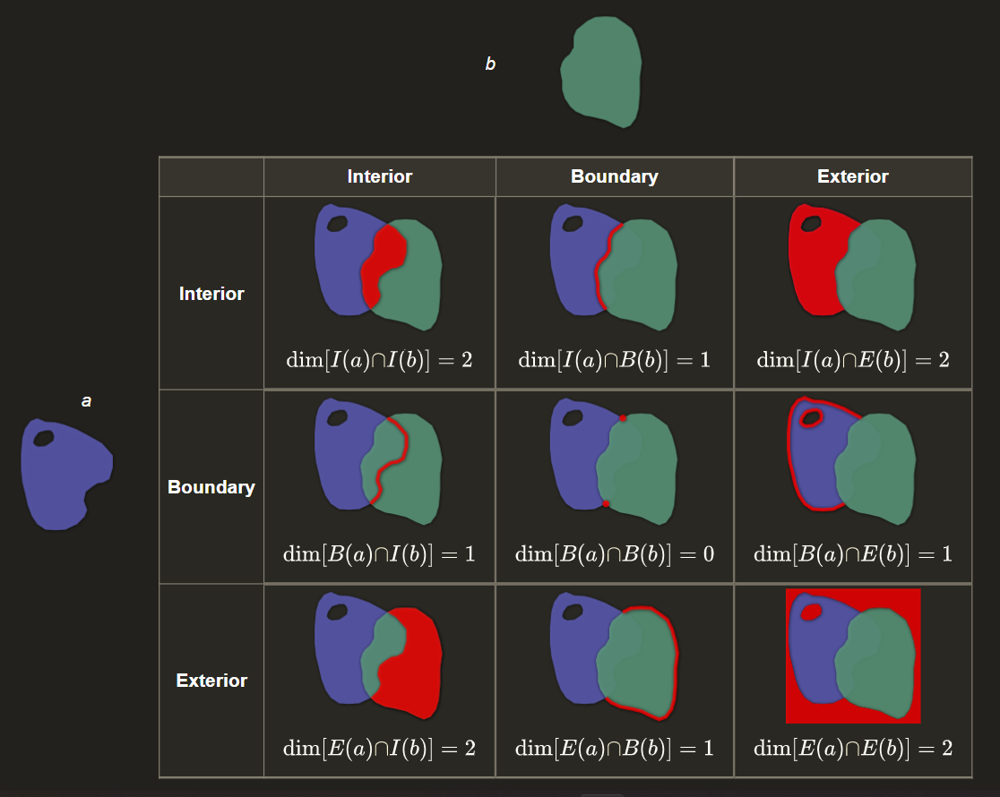

\tableofcontents 
\listoffigures
\listoftables

Assigned Reading: Chapter 3 of Spatial Data Science

```{r Load Libraries, message = F, warning = F, echo = F}
shhh <- suppressPackageStartupMessages #  silence messages.

shhh(library(tidyverse))
shhh(library(raster))
shhh(library(terra))
shhh(library(sf))
shhh(library(spData))
shhh(library(parallel))
shhh(library(fields))
shhh(library(spdep))
shhh(library(gstat))
shhh(library(spatstat))

rm(shhh)
```

```{r Import Chicago Neighborhoods Polygons, warning = F, echo = F}
files <- paste0('./spatial_lecture_data/Chicago_Neighborhoods/',
                list.files('./spatial_lecture_data/Chicago_Neighborhoods', ".shp"))
chi_neighb <- read_sf(files)
rm(files)
```

```{r Import Chicago Park District Polygons, warning = F, echo = F, cache = T}
files <- paste0('./spatial_lecture_data/Chicago_Park_District_Park_Boundaries/' ,
                list.files('./spatial_lecture_data/Chicago_Park_District_Park_Boundaries', ".shp"))
chi_parks <- read_sf(files) %>% 
  dplyr::select(acres, park, park_class) %>% 
  st_make_valid() %>% 
  st_simplify(dTolerance = 100)

chi_neighb1 <- st_intersection(chi_neighb, chi_parks)
park_areas <- chi_neighb1 %>% 
  mutate(areas = as.numeric(st_area(.))/1000) %>% 
  group_by(pri_neigh) %>% 
  mutate(total_park_area = sum(areas)) %>% 
  distinct(pri_neigh, .keep_all = T) %>% 
  st_drop_geometry() %>% 
  dplyr::select(pri_neigh, total_park_area)

rm(files, chi_neighb1)
```

```{r Create Interpolation Visual Aids, echo = F, message = F, warning = F}

locations_pts <- as.data.frame(cbind(
  site = sample(letters, size = 20, replace = F),
  x = sample(-10:10, size = 20), 
  y = sample(-10:10, size = 20)))

locations_lines <- data.frame(cbind(
  locations_pts[,2:3],
  cen_x = rep(0.5, size = 20), 
  cen_y = rep(0.5, size = 20)))

locations_lines <- lapply(locations_lines, as.numeric)
locations_lines <- do.call(cbind, locations_lines)

ex_linestring <- list(0)
for (i in 1:nrow(locations_lines)){
  ex_linestring[[i]] <- rbind(
        c(locations_lines[i, 1], locations_lines[i, 2]), 
        c(locations_lines[i, 3], locations_lines[i, 4]),
        c(locations_lines[i, 1], locations_lines[i, 2])
      )
}

locations_lines <- st_multilinestring(ex_linestring)

locations_pts <- st_as_sf(locations_pts, coords= c(x='x', y ='y'), remove = F)
ex_point <- st_point(c(0.5,0.5))

locations_pts <- locations_pts %>% 
  mutate(distance = -log(st_distance(locations_pts, ex_point)))

r_ext <- raster::raster(
    xmn = -10, 
    xmx = 10,
    ymn = -10,
    ymx = 10
)
r_ext <- st_bbox(r_ext)

grid <- st_make_grid(r_ext,  # create a fishnet to emulate the idea of an empty raster ! :-)
  n = c(10, 10),
  what = "polygons",
  square = TRUE,
  flat_topped = FALSE)
grid <- st_multipolygon(grid)

rm(ex_point, i, ex_linestring, r_ext)
```

```{r Create Museum Dummy Data, echo = F, message = F, warning = F}
AM <- as_tibble(cbind(attribute = 'American',
                latitude = 40.781563, 
                longitude = -73.974751)) %>% 
  st_as_sf(coords = c(x = 'longitude', y = 'latitude'), 
           crs = 4326, remove = F)
FM <- as_tibble(cbind(attribute = 'Field',
                latitude = 41.866662,
                longitude = -87.616433)) %>% 
  st_as_sf(coords = c(x = 'longitude', y = 'latitude'), 
           crs = 4326, remove = F)
SM <- as_tibble(cbind(attribute = 'Smithsonian',
                latitude = 38.890766,
                longitude = -77.025666)) %>% 
  st_as_sf(coords = c(x = 'longitude', y = 'latitude'), 
           crs = 4326, remove = F)

```

```{r Define Functions, echo = F}
journeys_to_sf <- function(journeys_data, # By Charlie
                           start_long = longitude,
                           start_lat = latitude,
                           end_long = longitude.end,
                           end_lat = latitude.end) {
  quo_start_long <- enquo(start_long)
  quo_start_lat <- enquo(start_lat)
  quo_end_long <- enquo(end_long)
  quo_end_lat <- enquo(end_lat)

  journeys_data %>%
    dplyr::select(
      !! quo_start_long,
      !! quo_start_lat,
      !! quo_end_long,
      !! quo_end_lat
    ) %>%
    transpose() %>%
    map(~ matrix(flatten_dbl(.), nrow = 2, byrow = TRUE)) %>%
    map(st_linestring) %>%
    st_sfc(crs = 4326) %>%
    st_sf(geometry = .) %>%
    bind_cols(journeys_data) %>%
    dplyr::select(everything(), geometry)
}

```

```{r Create Polygons to test spatial predicates, echo  = F}

A <- st_polygon( # complete
  list(
    rbind(
      c(1,2), c(3,4), c(3.5,3), c(3.5,2),
      c(3,1), c(1,2) 
    )
  )
)

B_disjoint <- st_polygon( # complete
  list(
    rbind(
      c(3.25,4.25), c(3.75,3.25), c(3.75,2.25),
      c(5.25,4.25), c(3.25,4.25)
    )
  )
)

B_touches <- st_polygon( # complete
  list(
    rbind(
      c(3,4), c(3.5,3), c(3.5,2),
      c(5,4), c(3,4)
    )
  )
)

B_overlap <- st_polygon( # complete
  list(
    rbind(
      c(3,2.5), c(3.5,1.5), c(3.5,0.5),
      c(5,2.5), c(3,2.5)
    )
  )
)

B_covers <- st_polygon( # complete
  list(
    rbind(
      c(2.75,3), c(3.5,3), c(3.5,2),
      c(2.75,2), c(2.75,3)
    )
  )
)

B_contains <- st_polygon( # complete
  list(
    rbind(
      c(2.25,3), c(3,3), c(3,2),
      c(2.25,2), c(2.25,3)
    )
  )
)

B_equals <- st_polygon( # complete
  list(
    rbind(
      c(1,2), c(3,4), c(3.5,3), c(3.5,2),
      c(3,1), c(1,2) 
    )
  )
)


disjoint_plot <- ggplot() +
   geom_sf(data = A, fill = "deeppink1", lty = 3) +
   geom_sf(data = B_disjoint, fill = "deepskyblue2", lty = 5) +
   xlim(0, 5) +
   ylim(0, 5) +
   labs(title="Disjoint") +
   theme_classic() +
   theme(plot.title = element_text(hjust = 0.5), 
        axis.title.x=element_blank(),
        axis.text.x=element_blank(),
        axis.ticks.x=element_blank(),
        axis.title.y=element_blank(),
        axis.text.y=element_blank(),
        axis.ticks.y=element_blank())
   
touches_plot <- ggplot() +
   geom_sf(data = A, fill = "deeppink1", lty = 3) +
   geom_sf(data = B_touches, fill = "deepskyblue2", lty = 5) +
   xlim(0, 5) +
   ylim(0, 5) +
   labs(title="Touches") +
   theme_classic() +
   theme(plot.title = element_text(hjust = 0.5),
        axis.title.x=element_blank(),
        axis.text.x=element_blank(),
        axis.ticks.x=element_blank(),
        axis.title.y=element_blank(),
        axis.text.y=element_blank(),
        axis.ticks.y=element_blank())

overlap_plot <- ggplot() +
   geom_sf(data = A, fill = "deeppink1", lty = 3) +
   geom_sf(data = B_overlap, fill = "deepskyblue2", lty = 5) +
   xlim(0, 5) +
   ylim(0, 5) +
   labs(title="Overlaps") +
   theme_classic() +
   theme(plot.title = element_text(hjust = 0.5),
        axis.title.x=element_blank(),
        axis.text.x=element_blank(),
        axis.ticks.x=element_blank(),
        axis.title.y=element_blank(),
        axis.text.y=element_blank(),
        axis.ticks.y=element_blank())

covers_plot <- ggplot() +
   geom_sf(data = A, fill = "deeppink1", lty = 3) +
   geom_sf(data = B_covers, fill = "deepskyblue2", lty = 5) +
   xlim(0, 5) +
   ylim(0, 5) +
   labs(title="Covers") +
   theme_classic() +
   theme(plot.title = element_text(hjust = 0.5),
        axis.title.x=element_blank(),
        axis.text.x=element_blank(),
        axis.ticks.x=element_blank(),
        axis.title.y=element_blank(),
        axis.text.y=element_blank(),
        axis.ticks.y=element_blank())

contains_plot <- ggplot() +
   geom_sf(data = A, fill = "deeppink1", lty = 3) +
   geom_sf(data = B_contains, fill = "deepskyblue2", lty = 5) +
   xlim(0, 5) +
   ylim(0, 5) +
   labs(title="Contains") +
   theme_classic() +
   theme(plot.title = element_text(hjust = 0.5),
        axis.title.x=element_blank(),
        axis.text.x=element_blank(),
        axis.ticks.x=element_blank(),
        axis.title.y=element_blank(),
        axis.text.y=element_blank(),
        axis.ticks.y=element_blank())

equals_plot <- ggplot() +
   geom_sf(data = A, fill = "deeppink1", lty = 3) +
   geom_sf(data = B_equals, fill = "deepskyblue2", lty = 5) +
   xlim(0, 5) +
   ylim(0, 5) +
   labs(title="Equals") +
   theme_classic() +
   theme(plot.title = element_text(hjust = 0.5),
        axis.title.x=element_blank(),
        axis.text.x=element_blank(),
        axis.ticks.x=element_blank(),
        axis.title.y=element_blank(),
        axis.text.y=element_blank(),
        axis.ticks.y=element_blank())
```

# Topology

While in the last lecture we emphasized the geographic components of data on in space, we will know turn our attention to some simple geometric properties of two and three dimensional objects. 

Essential to most GIS operations is Topology, 

## Theoretical Relations

Most sets of relations between objects in two dimension are considered below by the Dimensionally Extended 9-Intersection Model (DE-9IM). The DE-9IM was developed to query spatial databases and still serves as the standard for describing relations. 

```{r, out.width = "50%", fig.show='hold', echo = F, fig.cap = "DE-9IM, By Krauss", fig.align="center"}

```

In the example in the Upper Middle panel 

The dimensions which contain the intersection of the 'Interior' of 'A' to the 'Boundary' of 'B' is equal to a line. 

$$
dim[I(a)∩B(b)] = 1
$$

<br>

- where 'I' is the 'Interior' (of 'a') & 'B' is the 'Boundary' (of 'b')

$$
\text{∩ is the 'Intersection'}
$$

<br>

 - '1' denotes that the product of the intersection is a line

In the example in the Upper Middle panel 

The dimensions which contain the intersection of the 'Interior' of 'A' to the 'Boundary' of 'B' is equal to a line. 

## Applications

When identifying solutions to a problem we are generally interested in how features affect each other. This schema provides us a framework for organizing our area of analyses, and subsetting the appropriate data. 

We are generally interested in : 

<br>

- *dim[I(a)∩I(b)] = 2* Which values are in both polygons 
- *dim[I(a)∩B(b)] = 1* Which values are in 'a', and at the boundary of 'b' 
- *dim[I(a)∩E(b)] = 2* Which values are in 'a', but not in 'b' 

<br>

- *dim[B(a)∩I(b)] = 1* Which values are at the boundary of 'a', and in 'b' 
- *dim[B(a)∩B(b)] = 0* Which values are at the shared boundaries of 'a' and 'b' 
- *dim[B(a)∩E(b)] = 1* Which values are at the boundary of 'a', and outside 'b' 

<br>

- *dim[E(a)∩I(b)] = 2* Which values are in 'b' but not in 'a' 
- *dim[E(a)∩B(b)] = 1* Which values are at the boundary of 'b' and outside 'a' 
- *dim[E(a)∩E(b)] = 2* Which values are outside both 'a' and 'b' 

<br>

# Geometric Operations on Spatial Predicates

## Theoretical Properties

```{r Plot Topology, echo = F, fig.cap = "Spatial Predicates after Egenhofer and Herring", fig.align="center"}
cowplot::plot_grid(disjoint_plot, touches_plot, overlap_plot, covers_plot, contains_plot, equals_plot, labels = NULL, ncol = 3)

rm(contains_plot, covers_plot, disjoint_plot, equals_plot, overlap_plot, touches_plot)
```

**Disjoint** Neither 'A' nor 'B' touch at any position

**Touches** The boundaries of 'A' and 'B' touch

**Covers** Feature 'A' is encapsulated by 'B' on many sides, at least a boundary of 'A' shares at least a partial border with a border of 'B'

**Contains** All borders of one feature are contained by another

**Overlap** Portions of the interior of feature 'A' overlap the interior of 'B'

**Equals** 'A' and 'B' have identical extents.

In addition to these logical tests, postGIS implements the following three tests. 'Intersects' obviously tends to find the most applications, as it generalizes from 3 other logical tests. 

**Intersects** (includes: 'st_contains', 'st_overlaps', 'st_covers')

**Within** (includes: 'st_contains')

**CoveredBy** (includes: 'st_equals')

## Applications

We may test these relationships quite readily using the sf package

```{r Spatial Predicates in SF, comment = "", echo = F}

writeLines(paste0('st_disjoint(A, B_disjoint, sparse = F): ', st_disjoint(A, B_disjoint, sparse = F)[1,1]))
writeLines(paste0('st_touches(A, B_touches, sparse = F): ', st_touches(A, B_touches, sparse = F)[1,1]))
writeLines(paste0('st_equals(A, B_overlap, sparse = F): ', st_overlaps(A, B_overlap, sparse = F)[1,1]))
writeLines(paste0('st_covers(A, B_covers, sparse = F): ',  st_covers(A, B_covers, sparse = F)[1,1]))
writeLines(paste0('st_contains(A, B_contains, sparse = F): ', st_contains(A, B_contains, sparse = F)[1,1]))
writeLines(paste0('st_equals(A, B_equals, sparse = F): ', st_equals(A, B_equals, sparse = F)[1,1]))
writeLines(paste0('st_equals(A, B_disjoint, sparse = F): ', st_equals(A, B_disjoint, sparse = F)[1,1]))

```

Applications:

```{r Spatial Predicates in SF 2, comment = "", echo = F}
writeLines(paste0('st_intersects(A, B_equals, sparse = F): ', st_intersects(A, B_equals, sparse = F)[1,1]))
writeLines(paste0('st_intersects(A, B_overlap, sparse = F): ', st_intersects(A, B_overlap, sparse = F)[1,1]))
writeLines(paste0('st_intersects(A, B_overlap, sparse = F): ', st_intersects(A, B_overlap, sparse = F)[1,1]))
writeLines(paste0('st_within(A, B_contains, sparse = F): ', st_within(A, B_contains, sparse = F)[1,1]))
writeLines(paste0('st_coveredby(A, B_equals, sparse = F): ', st_covered_by(A, B_equals, sparse = F)[1,1]))

rm(A, B_disjoint, B_contains, B_covers, B_equals, B_overlap, B_touches)
```

## Spatial Join

- Combine two spatial objects, based on their spatial relations. 
- May use nearly all of the predicates above, and more!
- Allows left or inner join (only records present in both objects)

```{r Spatial Joins 1, comment = "", message = F, warning = F}

nghbrhd_parks <- st_join(chi_neighb, chi_parks, 
               join = st_intersects, 
               left = TRUE 
               ) %>% 
  count(pri_neigh) 
```

```{r Spatial Joins 2, comment = "", message = F, warning = F, echo = F}
bound <- st_bbox(chi_neighb)
    
a <- ggplot(chi_neighb) +
  geom_sf(fill = "#B3DDF2") + 
  coord_sf(xlim = c(bound[1],bound[3]), ylim = c(bound[2],bound[4])) +
  theme_void()  

b <- ggplot(chi_parks) + 
  geom_sf(fill = "#FF0000") +
  coord_sf(xlim = c(bound[1],bound[3]), ylim = c(bound[2],bound[4])) +
  theme_void()
  
c <- ggplot() + 
  geom_sf(data = nghbrhd_parks, aes(fill = n)) + 
  coord_sf(xlim = c(bound[1],bound[3]), ylim = c(bound[2],bound[4])) +
  theme_void() +
  theme(legend.position = "none")

cowplot::plot_grid(a, b, c, ncol = 3)

rm(bound, a, b, c)
```


# Spatial autocorrelation 

## Tobler's First Law

"I invoke the first law of geography: 
everything is related to everything else, 
but near things are more related than distant things." 
- Waldo Tobler

Accordingly, if we want to model processes in space, 
considerable information may be found from those locations in closet
proximity. 

## Autocorrelation

The correlation between two values of a variable as function of the 'lags' between them. 

### Temporal Autocorrelation

If we were to measure the height of a fast growing plant in a greenhouse every week for a year, each measured value would be strongly related to the value collected the week preceding it.

```{r Temporal Autocorrelation 1, echo = F, out.width="50%", comment = "", fig.align="center"}

plant_hgt <- sample(1000, 56, replace = F)
plant_hgt <- sort(plant_hgt)

a <- plant_hgt[-length(plant_hgt)]
b <- plant_hgt[-1]

plot(x = b, y = a, xlab = "Height in millimeters t1", 
     main = "Relationship between Plant height at week t and week t-1", 
     ylab = "Height in millimeters t-1")
  abline(0,1, lty = 2)

cor(a, b)
acf(plant_hgt)

rm(a, b, plant_hgt)
```

Until we go to around 15 lags away -  or in other words 15 weeks back, our data set is significantly auto-correlated. In statistics this will adversely affect the results of our models. However, this information can also be used. 

## Spatial Autocorrelation

Spatial auto correlation is a 2 dimensional phenomenon, and is slightly harder to visualize. 

```{r Spatial autocorellation example, echo = F, fig.cap= "Example figure of spatial autocorrelation. From L to R, Positive, None, Negative"}

r1 <- raster(nrow = 8, ncol = 7)

m1 <- matrix(rep(0:1, each = 28), 
             nrow = 8,
             ncol = 7,
             byrow=TRUE)
r1a <- setValues(r1, m1)

m2 <- matrix(sample(0:1, size = 56, replace = T), 
             nrow = 8,
             ncol = 7,
             byrow=TRUE)
r2a <- setValues(r1, m2)

m3 <- matrix(rep(0:1, each = 1), 
             nrow = 8,
             ncol = 7,
             byrow=T)
r3a <- setValues(r1, m3)

a <- tmap::tm_shape(r1a) +
  tmap::tm_raster(style= "cat", title="Positive",
                  palette = c("black", "white"), legend.show = F)

b <- tmap::tm_shape(r2a) +
  tmap::tm_raster(style= "cat", title="None",
                  palette = c("black", "white"), legend.show = F)

c <- tmap::tm_shape(r3a) +
  tmap::tm_raster(style= "cat",  title="Negative",
                  palette = c("black", "white"), legend.show = F)

tmap::tmap_arrange(a, b, c, ncol = 3, outer.margins = NULL)

rm(r1, m1, m2, m3, r1a, r2a, r3a, a, b, c)
```

### Calculate Morans I

Here we will see if there is a an spatial pattern in the presence of Park Areas in Chicago. First, we will intersect each park to the neighborhood they are in. Then we will determine what proportion of each neighborhood is Park.

```{r Spatial Autocorrelation 2, echo = F, comment = "", fig.cap = "Chicago Neighbors of Neighborhoods", fig.align="center"}

chi_neighb <- left_join(chi_neighb, park_areas, by = "pri_neigh") %>% 
  mutate(neigh_area = as.numeric(st_area(.)/1000)) %>% 
  mutate(prop_park = (total_park_area/neigh_area)*100) %>% 
  mutate(prop_park = replace_na(prop_park, 0)) %>% 
  dplyr::select(-total_park_area, neigh_area) 

chi_neigh_sp <- as(chi_neighb, 'Spatial') # convert so sp

neighborhood_object <- poly2nb(chi_neigh_sp, row.names=chi_neigh_sp$pri_neigh) 
# identify neighbors
chi_neighb_coords <- coordinates(chi_neigh_sp) # extract coords for plotting 

#plot(chi_neigh_sp, col = "#B3DDF2")
#plot(neighborhood_object, chi_neighb_coords, col="#FF0000", lwd=2, add=TRUE)
summary(neighborhood_object)

spatial_weights_list <-  nb2listw(neighborhood_object, style='B')

monte_carlo_moran<- moran.mc(chi_neigh_sp$prop_park, spatial_weights_list, nsim=999)

monte_carlo_moran

rm(monte_carlo_moran, neighborhood_object, chi_neighb_coords, spatial_weights_list, chi_neigh_sp, park_areas)
```

The null hypothesis of this test is that the data are randomly distributed
The statistic ranges from 1 (perfect clustering of similar values) to -1 (perfect dispersion; opposites values close).
 
This test tells us that there is some spatial structure in our data, but we do not know the geographic range to which this structuring is present. 

If we recall the location of the Chicago Parks, the most noticeable cluster of them is along the Lake Shore. I presume that the Moran.I index is slightly above random due to the presence of these. It also points out an interesting point regarding the history of the development of Chicago. A focus on restricting development along the Shore.  Chicago is quite unique in that it's coasts are publicly accessible, and can largely be owed to the contributions of Montgomery Ward.

This amount of spatial auto-correlation would not adversely affect analyses, not too mention, this is an real pattern of these data.

https://www.chicagotribune.com/news/ct-xpm-1995-10-19-9510190079-story.html 02.04.2022 By: Stephen Lee and Tribune Staff Writer. Chicago Tribune. 10.19.1995

https://www.fotp.org/lakefront-protection-and-public-trust.html 02.04.2022

# Change Grain of Raster Cells. 

- Spatial *Extent* of projects often constrained by areas funding (political boundaries via funds from agencies), or computation power. 
- *Grain* of projects almost always constrained by computer power, or data sets.

Within an *extent* an analyst wants to find a *grain* relevant to the their study. *Grain* can be, somewhat readily, altered. 

## Raster Cell Aggregation (Coarser Grain)

Rasters may be of a resolution which is to fine to warrant use due to computational limits.

```{r Raster Cell Aggregation, echo = F, fig.cap = "Raster Aggregation", out.width = "75%", fig.align="center"}
mycores <- parallel::detectCores() - 1 # this process can be made parallel
# We will use a logical thread on our CPI's to work across the raster in chunks. 

val_RCA_ex <- seq(from = 1, to = 9801, by = 1)
r_RCA_ex <- raster::raster(nrows = 99, ncols = 99)
r_RCA_ex <- setValues(r_RCA_ex, val_RCA_ex)

ra_max <- raster::aggregate(r_RCA_ex, 
                fact=3, 
# factor to divide cells by 100 original cells / factor 10 = 10 cells left.
                fun=max, 
# which mathematical function to apply. 
                na.rm = T,
                cores = mycores, 
# make process parallel. Good for LARGE jobs. 
#filename = , # results can be written straight to file. 
                overwite = FALSE,
                )

ra_mean <- raster::aggregate(r_RCA_ex, fact= 9, fun=mean, na.rm = T, cores = mycores)
ra_mean_2 <- raster::aggregate(r_RCA_ex, fact= 18, fun=mean, na.rm = T, cores = mycores)

par(mfrow = c(2,2), mai = c(0.5, 0.5, 0.5, 1), oma = c(0,0,0,1.1))
plot(r_RCA_ex, legend = F, main = "Original Cell Size")

plot(ra_max, main = "Aggregated by factor of 3", 
     legend.args = list(text = 'Values', side = 4,
         font = 2, line = 2.5, cex = 0.8))

plot(ra_mean, legend = F, main = "Aggregated by factor of 9")

plot(ra_mean_2, main = "Aggregated by factor of 18", 
     legend.args = list(text = 'Values', side = 4,
         font = 2, line = 2.5, cex = 0.8))

rm(val_RCA_ex, r_RCA_ex, ra_max, ra_mean, ra_mean_2, mycores)
```

## Raster Interpolation (Finer Grain)

- Predict the value of a variable at an un-sampled location
- Using the values of this variable at sampled locations
- Utilizes the property of spatial auto-correlation

While a great number of raster data sets are developed form satellite imagery and represent the classification of observed values at each location in space, other raster data sets have values which are predicted in space. The most evident example of these are raster products of climate variables. All rasters of climate variables are based on measurements taken from meteorological stations, and then the values between these stations are predicted using spatial interpolation.

```{r, out.width = "50%", fig.align="center", fig.show='hold', echo = F, fig.cap = "Surveying in the White Cloud Mtns. Idaho, by Hubert Szycygiel"}
knitr::include_graphics("./pictures/Moving_survey_equipment.HSzycygiel.JPG")
```

Two of the most commonly used spatial interpolation techniques are 'Inverse Distance Weighting' and 'Kriging' interpolation. Our interaction with these processes will be brief, but we will illustrate their uses so that you may recognize the source of spatial data products in the future. 

We will leverage simple versions of these techniques to create Rasters of finer resolution than they are currently. 

### Inverse Distance Weighting Theory

- First Interpolation Method
- Values at points further in space have less weight
- Scale of weight generally decreases linearly or linear^2 

```{r Inverse Distance Weighting Interpolation Theory, echo = F, fig.align="center", fig.cap = "Inverse Distance Weighing Interpolation Theory", out.width = "75%"}

ggplot() +
  geom_sf(data = grid, aes(color = "mediumorchid4")) +
  geom_sf(data = locations_lines, alpha = 0.8) +
  geom_sf(data = locations_pts, aes(size=distance, color = "darkturquoise")) +
  xlim(-10, 10) +
  ylim(-10, 10) +
  labs(title="Inverse Distance Weighting", sub = "Point size is the inverse distance ^2 to focal location") +
  theme_bw() +
  theme(plot.title = element_text(hjust = 0.5), 
        legend.position = "") 

rm(locations_lines, locations_pts, grid)
```

```{r IDW Interpolation of a Raster, echo = F, warning = F, message = F, comment = ""}
elevation_raster <- rast(system.file("ex/elev.tif", package="terra")) 
elevation_raster_coarse <- raster::aggregate(elevation_raster, 2) 
coords <- data.frame(xyFromCell(elevation_raster_coarse, 1:ncell(elevation_raster_coarse)))
rast_vals <- values(elevation_raster_coarse) 
index <- !is.na(rast_vals) 
coords <- coords[index,]

rast_vals <- rast_vals[index]
prediction_IDW <- rast(elevation_raster)

my_sample <-  sample(1:nrow(coords), round(nrow(coords)*0.7, 0))

rast_vals <- rast_vals[my_sample]
coords <- coords[my_sample,]
points <- cbind(rast_vals, coords) %>% 
  st_as_sf(coords = c(x = 'x', y = 'y'), crs = 4326) 
points <- as(points, 'Spatial')

tps <- fields::Tps(coords, rast_vals)
prediction_IDW <- interpolate(prediction_IDW, tps)
prediction_IDW <- mask(prediction_IDW, elevation_raster)

rm(tps, index, rast_vals, my_sample)
```

To read more about Inverse Distance Weighting, and view worked out calculations of the process please visit: 
https://www.geo.fu-berlin.de/en/v/soga/Geodata-analysis/geostatistics/Inverse-Distance-Weighting/index.html

Inverse Distance Weighting is the original spatial interpolation technique and makes great use of Tobler's First Law. While using this technique, we want to predict the value of a variable, such as rainfall, in a location. 

## Kriging Interpolation

https://mgimond.github.io/Spatial/interpolation-in-r.html

### Semivariogram

A semivariogram is a method for measuring the correlation between observations at sets of distance.

```{r Example semivariogram, out.width = "50%", fig.align="center", echo = F}
semivar_data <- data.frame(
  Distance =     c(0,3,5,9.00,12,15, 20,23.0,25,28,31,34.0,36.0,38.0,40,42.1,44,47,55),
  Semivariance = c(4,6,7,10.0,14,17, 20,20.2,20,20,20,20.5,19.8,19.7,20,20.7,20,20,20)
)

ggplot(semivar_data, aes(Distance, Semivariance)) +
  geom_point(color = "#984ea3") +
  geom_smooth(method = 'loess',  se = FALSE, span = 0.8, col = "#e41a1c") +
  theme_bw() +
  
  xlim(0, 60) +
  ylim(0, 30) +
  
  labs(title = "Example Semivariogram") +
  theme(plot.title = element_text(hjust = 0.5)) +
  
  geom_segment(aes(x = 23, y =  0, xend = 23, yend = 20), lwd = 1.25, lty = 6) +
  geom_segment(aes(x =  0, y = 20, xend = 23, yend = 20), lwd = 1.25, lty = 6) +
  geom_segment(aes(x =  0, y =  0, xend =  0, yend =  3), lwd = 1.25, lty = 6) +
  geom_text(x=25, y=10, label = "Sill") +
  geom_text(x=10, y=21, label = "Range") +
  geom_text(x= 3, y= 1, label = "Nuggett") +
  
  #geom_segment(aes(x = 22, y = 25, xend = 0, yend = 25), arrow = arrow(length = unit(0.03, "npc"))) #+
  #geom_segment(aes(x = 25, y = 25, xend = 47, yend = 25),
  #  arrow = arrow(length = unit(0.03, "npc"))) +
  geom_text(x=10, y=27, label= "Autocorrelated") +
  geom_text(x=35, y=27, label = "Uncorrelated") 


rm(semivar_data)
```

- Nugget: Variation due to errors in the observed measurements. 
- Sill: Distance at which the maximum amount of variance in the data is reached.
- Range: Distance at which observations are independent. 

- Model: The red line indicates a model which has been fitted to the points (observations), in this example with fictitious data the model is closet to a spherical model. 

To determine the range of spatial auto-correlation we can use a Semivariogram
```{r Semivariogram on Elevation Data, fig.align="center"}
variogram_elevation <- variogram(rast_vals~1, data = points)

FittedModel <- fit.variogram(variogram_elevation, vgm(c( "Exp", "Sph", "Gau", "Mat"), 
                                 fit.kappa = TRUE))

a <- plot(variogram_elevation, main = "Variogram of Elevation Points")
b <- plot(variogram_elevation, model=FittedModel, main = "Fitted Variogram of Elevation Points", yaxt="n")
cowplot::plot_grid(a, b,  ncol = 1)

rm(variogram_elevation)
```

We can also view directions with predominant auto-correlation.

```{r Test for Anisotropy, warning = F, message = F, echo = F, out.width = "75%", fig.align="center"}

vgm.aniso <- variogram(rast_vals ~ 1, points, alpha = c(0, 45, 90, 135))
direction <- split(vgm.aniso, f= vgm.aniso$dir.hor)

fit_zero <- fit.variogram(direction[['0']], vgm(c( "Exp", "Sph", "Gau", "Mat"), 
                                 fit.kappa = TRUE))
fit_45 <- fit.variogram(direction[['45']], vgm(c( "Exp", "Sph", "Gau", "Mat"), 
                                 fit.kappa = TRUE))
fit_90 <- fit.variogram(direction[['90']], vgm(c( "Exp", "Sph", "Gau", "Mat"), 
                                 fit.kappa = TRUE))
fit_135 <- fit.variogram(direction[['135']], vgm(c( "Exp", "Sph", "Gau", "Mat"), 
                                 fit.kappa = TRUE))
  
a <- plot(direction[['0']],   model=fit_zero,  main = "0°", ylim = c(0,7000),  xlab = "",)
b <- plot(direction[['45']],  model=fit_45,    main = "45°", ylim = c(0,7000), ylab = "", yaxt="n",  xlab = "",)
c <- plot(direction[['90']],  model=fit_90,    main = "90°", ylim = c(0,7000))
d <- plot(direction[['135']], model=fit_135,   main = "135°", ylim = c(0,7000), ylab = "", yaxt="n")

# ggplot(aes(x = dist, y = gamma), data = vgm.aniso) + 
#   facet_wrap(~dir.hor) + 
#   geom_point() + 
#   theme_bw() + 
#   theme(plot.title = element_text(hjust = 0.5)) + 
#   labs(x = 'Distance', y = 'Gamma', 
#        title = 'Detecting Directional Anisotropy with Variograms')

cowplot::plot_grid(a, b, c, d,  ncol = 2)

#fit_test <- vgm(as.character(FittedModel$model[2]), as.character(FittedModel$range[2]), anis = c(90, 0.5))

rm(vgm.aniso, direction, fit_zero, fit_45, fit_90, fit_135, a , b, c, d)
```

We see that heading in both 45 and 90 degree angles the effect of spatial auto-correlation deteriorates

## Kriging Inteprolation applied

```{r Kriging Interpolation,  warning = F, message = F, echo = F}
coords1 <- data.frame(xyFromCell(elevation_raster, 1:ncell(elevation_raster)))
gridded(coords1) = ~x+y
crs(coords1) <- crs(points)

pred.reg <- krige(rast_vals ~ 1, points, coords1, model = FittedModel)
pred.reg <- rast(raster::raster(pred.reg))
pred.reg <- mask(pred.reg, elevation_raster)

rm(coords, coords1, FittedModel)
```

## Compare Interpolated Values

We can visually assess the results of our two interpolations using maps. 

```{r Comparision of Interpolated Values 1, echo = F, warning = F, message = F,out.width = "75%", fig.cap="Comparision of Interpolated Values", fig.align="center"}

a <- tmap::tm_shape(elevation_raster) +
  tmap::tm_raster(style= "cont", title="Original", 
                  palette = "viridis", legend.reverse = T, 
                  breaks = c(200, 300, 400, 500)) +
  tmap::tm_layout(legend.position = c("right","top")) 

b <- tmap::tm_shape(elevation_raster_coarse) +
  tmap::tm_raster(style= "cont", title="Aggregate", palette = "viridis", 
                  legend.reverse = T, breaks = c(200, 300, 400, 500)) +
  tmap::tm_layout(legend.position = c("right","top")) 

c <- tmap::tm_shape(prediction_IDW) +
  tmap::tm_raster(style= "cont", title="IDW", 
                  palette = "viridis", legend.reverse = T, 
                  breaks = c(200, 300, 400, 500)) +
  tmap::tm_layout(legend.position = c("right","top"))

d <- tmap::tm_shape(pred.reg) +
  tmap::tm_raster(style= "cont", title="Krige", 
                  palette = "viridis", legend.reverse = T, 
                  breaks = c(200, 300, 400, 500)) +
  tmap::tm_layout(legend.position = c("right","top"))

b <- b + tmap::tm_shape(points) +
  tmap::tm_dots(title="Locations", col = 'mediumvioletred')

tmap::tmap_arrange(a, b, c, d, widths = c(.5, .5))

rm(a, b, c, d, points)
```

Remember after importing the *Original* dataset, we merged four cells into one to create our *Aggregate* dataset. We then sampled 1/4 of the aggregated cells, to compute both the *IDW* and *Krige* rasters. we can see that both of them 'smooth' the Aggregated raster. Based on visual inspection, both of our interpolated surfaces appear to match up with the Original raster quite well - for many applications.

```{r Comparision of Interpolated Values 2, warning = F, message = F, echo = F, comment = "", out.width="50%", fig.align="center"}

reference <- spatSample(elevation_raster, size=3000, cells=TRUE) %>% drop_na() %>% mutate(Type = "Original")
aggregated_ref <- spatSample(elevation_raster_coarse, size=3000, cells=TRUE) %>% drop_na() %>% mutate(Type = "Reference_Aggregated")
krige <- spatSample(pred.reg, size=3000, cells=TRUE) %>% drop_na() %>% mutate(Type = "Krige") %>% rename(elevation = var1.pred)
idw <- spatSample(prediction_IDW, size = 3000, cells = T ) %>% drop_na() %>% mutate(Type = "IDW")

r <- min(
  t(
    as.data.frame(
      (lapply
       (as.list(c(reference, aggregated_ref, krige, idw)), 
         length))
      )
    )
  )

reference <- reference[sample(1:r),]
aggregated_ref <- aggregated_ref[sample(1:r),]
krige <- krige[sample(1:r),]
idw <- idw[sample(1:r),]

compare <- rbind(reference, aggregated_ref, krige, idw)
compare <- compare[order(compare$elevation),]

kruskal.test(compare$elevation, g = compare$Type)
boxplot(elevation~Type, data=compare, notch=TRUE,
  col=(c("cadetblue","brown3", "darkorchid3", "olivedrab2")),
  main="Distribution of Elevation Values from Raster", xlab="Raster", ylab= "Elevation (m)")

rm(reference, aggregated_ref, krige, idw, compare, elevation_raster, elevation_raster_coarse, pred.reg, prediction_IDW)
```

We can actually check whether the values are similar to the Original raster, and they are. 

Kruskal Wallis null hypothesis: the means of each group is the same, we cannot reject the null hypothesis. We see that Krige may 'smooth' the results at either end more than IDW, this is a known parameter of it. 
# Assorted Spatial Vector Operations

This is really a grab bag of what I and others seem to use most the often. We are going to focus on vector data. 

## Import a Vector file

- Many formats of vector files may be imported to R. 

```{r Import a Vector file, eval = F}
files <- paste0('./spatial_lecture_data/Chicago_Neighborhoods/' ,
                list.files('./spatial_lecture_data/Chicago_Neighborhoods', ".shp"))
chi_neighb <- read_sf(files)
rm(files)
```


## Make a geometry valid as a Simple Feature

You may import vector data which is not compliant with the Standards of the geometry for simple features. If you do this you will get a shocking warning, but the fix is quite simple. 

```{r Make Geometry Valid as a Simple Feature 1}
p1 = st_as_sfc("POLYGON((0 0, 0 10, 10 0, 10 10, 0 0))")
# create a geometry which will not be valid
```

```{r Make Geometry Valid as a Simple Feature 2, eval = F}
st_is_valid(p1)
st_is_valid(p1, reason = TRUE)
```

```{r Make Geometry Valid as a Simple Feature 3, echo = F, comment = ""}
writeLines(paste0("st_is_valid(p1): ", st_is_valid(p1))) 
writeLines(paste0("st_is_valid(p1, reason = TRUE): ", st_is_valid(p1, reason = TRUE)))
```

We see that this geometry contains a line which intersects itself. Ff we refer to our first lecture in our introductory slides on Simple features we can across a rule *"Lines composing polygons cannot intersect"* - the feature we created violates this rule. 

In this case we can retain all geometric features by simply applying the function st_make_valid()
```{r Make Geometry Valid as a Simple Feature 4}
p2 <- st_make_valid(p1)
```

We can plot both the old and new features side by side, and label the coordinates, to see how SF made our geometry valid. 
```{r Make Geometry Valid as a Simple Feature 5, echo = F, fig.align="center", comment = ""}
ex <- data.frame(X = p1[[1]][[1]][,1], Y = p1[[1]][[1]][,2])
ex$Name <- paste0("c(", "x = ",  ex$X, ", y = ", ex$Y, ")")
  
ex2 <- data.frame(rbind(X = p2[[1]][[1]][[1]],
                  Y = p2[[1]][[2]][[1]]))
colnames(ex2) <- c('X', 'Y')
ex2$Name <- paste0("c(", "x = ",  ex2$X, ", y = ", ex2$Y, ")")
  
a <- ggplot() +
  geom_sf(data = p1, fill = "darkseagreen")+
  geom_point(data = ex, aes(x = X, y = Y), size = 3) +
  xlim(-10, 15) +
  ylim(-10, 15) +
  theme_bw() +
  ggrepel::geom_label_repel(data = ex, aes(x = X, y = Y,label = Name),
                  box.padding   = 0.5, 
                  point.padding = 0.5,
                  segment.color = 'purple') +
  labs(title = "Non-Valid Geometry") +
  theme(plot.title = element_text(hjust = 0.5))

b <- ggplot() +
  geom_sf(data = p2, fill = "darkseagreen")+
  geom_point(data = ex2, aes(x = X, y = Y), size = 3) +
  xlim(-10, 15) +
  ylim(-10, 15) +
  theme_bw() +
  ggrepel::geom_label_repel(data = ex2, aes(x = X, y = Y,label = Name),
                  box.padding   = 0.5, 
                  point.padding = 0.5,
                  segment.color = 'purple') +
  labs(title = "Valid Geometry") +
  theme(plot.title = element_text(hjust = 0.5))

writeLines(paste0("If we call class(p1), we can see that our original simple feature collection (sfc) contained: ", class(p1)[1])) 
writeLines(paste0("If we call class(p2), we can see that our valid simple feature collection (sfc) contains: ", class(p2)[1])) 

cowplot::plot_grid(a, b, ncol = 2)
rm(p1, p2, ex, ex2, a,b)
```
As you see from our initial non-valid polygon, a second was created which resolves the geometry problem. Now our feature is represented by two polygons. From our earlier lecture please recall that the start and end points composing the line and polygon simple feature geometries are always the same coordinate pair.  Hence you can see that the coordinates of contention, x = 5 & y = 5, have become the new start and end points of our second polygon.

## Aggregate Simple Features via 'group_by' & 'summarize'

- Can be used to combine the geometries of features

```{r Summarize 1, echo = F}
regions <- us_states %>%
  group_by(REGION) %>% 
  summarize(geometry = st_union(geometry))
```

```{r Summarize 2, echo = F}
a <- ggplot(us_states) +
  geom_sf() +
  theme_void()

b <- ggplot(regions) +
  geom_sf() +
  theme_void()

cowplot::plot_grid(a, b, ncol = 1)
```


# Area Calculations

SF is readily capable of calculating the area of polygon features.

```{r Area 1, message = F, eval = F}
st_area(chi_neighb)
```

```{r Area 2, message = F, echo = F}
st_area(chi_neighb)[1:5]
```

These data are always returned in units of meters, regardless of the coordinate system specifications. However, different Coordinate Systems will give different results 

```{r Area 3, message = F, comment = "", echo = F, fig.align="center", out.width = "50%"}
areas_proj <- chi_neighb %>% 
  st_transform(32610) %>% 
  st_area() 
# projected CRS UTM

areas_geog <- chi_neighb %>% 
  st_transform(4326) %>% 
  st_area() 
# Geographic CRS

# ensure these are in the same order
areas_proj <- sort(areas_proj)
areas_geog <- sort(areas_geog)

# are all values the same??
which(areas_proj == areas_geog)

min(areas_geog)
max(areas_proj)

#  what is the correlation between the two methods of measurement?
res <- cor.test(areas_proj, areas_geog,  method="kendall") # tau of 1, perfect correlation

# what is the relationship.
plot(x = areas_geog, y = areas_proj, pch = 18, xlim = c(min(areas_geog),max(areas_proj)), 
     ylim = c(min(areas_geog), max(areas_proj)), 
     main = "Area of Geographic CRS Polgyons plotted against Projected CRS") + 
  abline(0,1, lty = 2) +
  text(min(areas_geog)*25, max(areas_proj)*0.975, paste0("tau = ", res[["estimate"]][["tau"]])) +
  text(min(areas_geog)*60, max(areas_proj)*0.90, paste0("p-value = ", " < 0.001"))
  
```

When we use the 'which' logical test, we see that all areas in the results from both sets of area calculations are different. When we plot the values we see that both sets have nearly perfect correlation. 

But neither of these values are as accurate as they could be. We want to use an Equal Area projected coordinate system instead. 

Here we use the NAD83 Conus Albers, a favorite of the United States Geological Survey (USGS). 
```{r Area 4, message = F, comment = ""}
equal_areas_proj <- chi_neighb%>% 
  st_transform(5070) %>% 
# We want to use an equal area projection! 
  st_area()

equal_areas_proj <- sort(equal_areas_proj)
```

While metric values are easy to convert by 'hand', we can also convert them using the 'units' package.
```{r Area 5, message = F, comment = ""}
units(equal_areas_proj) <- units::make_units(km^2)
head(equal_areas_proj)
```


```{r Area - 6, message = F, echo = F, fig.align="center"}

equal_areas_proj <- chi_neighb%>% 
  st_transform(5070) %>% 
# if for some reason need a project system - use equal area! 
  st_area()
areas <- as.numeric(equal_areas_proj)

areas <- cbind(chi_neighb, areas) 
largest <- areas %>% 
  arrange(-areas) %>% 
  slice_head(n = 5) %>% 
  st_drop_geometry() %>% 
  dplyr::select(1,5) 
  
smallest <- areas %>% 
  arrange(areas) %>% 
  slice_head(n = 5) %>% 
  st_drop_geometry() %>% 
  dplyr::select(1,5) %>% 
  dplyr::rename(Neigh = pri_neigh,  
                Area = .$areas) 

cbind(smallest, largest) %>% knitr::kable( 
      booktabs = T, 
      align = c("r"), 
      caption = "Size of the Largest and Smallest Neighborhoods in Chicago", 
      col.names = c("Neighborhood", "Area (m^2)","Neighborhood", "Area (m^2)")) %>% 
  kableExtra::kable_styling("striped", full_width = F, 
                position = "left", font_size = 12) %>% 
  kableExtra::add_header_above(c("Smallest" = 2, "Largest" = 2)) 

rm(areas, smallest, largest, areas_geog, areas_proj, equal_areas_proj, res)
```

# Centroids & Point on Surface

- Centroid the "geometric center of mass of a geometry" of an object.  

- If you just need an arbitrary point on the surface of an object Point on Surface will suffice. 

```{r Centoid and POS, message = F, warning = F}
chi_cent <- st_centroid(chi_neighb)
chi_pos <- st_point_on_surface(chi_neighb)
```

```{r Centroid and POS Plot, echo = F, fig.align="center", out.width = "75%"}

c_line <- st_linestring( 
    rbind(
      c(1,1), c(4,1), c(4,4),c(1,4)
    )
  )

c_polygon <- st_polygon( 
  list(
    rbind(
      c(1,1), c(4,1), c(4,4),c(1,4), 
      c(0.5, 4.5), c(4.5, 4.5), c(4.5, 0.5), c(0.5,0.5), c(1,1) 
    )
  )
)

c_line_cen <- st_centroid(c_line)
c_poly_cen <- st_centroid(c_polygon)

ggplot() +
  geom_sf(data = chi_neighb, fill = "#B3DDF2", color ="#FFFFFF") +
  geom_sf(data = chi_cent, color = "#FF0000") +
  labs(title = "Centroids of Neighborhoods") +
  theme_light() +
  theme(plot.title = element_text(hjust = 0.5)) 

a <- ggplot(c_line) +
  geom_sf()+
  geom_sf(data = c_line_cen, size = 4, color = 'red') +
  theme_void()

b <- ggplot(c_polygon) +
  geom_sf() +
  geom_sf(data = c_poly_cen, size = 4, color = 'red') +
  theme_void()

cowplot::plot_grid(a, b, ncol = 1)

ggplot() +
  geom_sf(data = chi_neighb, fill = "#B3DDF2", color ="#FFFFFF") +
  geom_sf(data = chi_pos, color = "#FF0000") +
  labs(title = "Point on Surface of Neighborhoods") +
  theme_light() +
  theme(plot.title = element_text(hjust = 0.5))

rm(chi_pos, chi_cent, a, b, c_line, c_polygon, c_line_cen, c_poly_cen, a, b)
```

# Combine & Union Features

- *Combine* will form a multipolygon
  - Retain all geometries as a multipolygon collection
  - Lose the attributes of each feature 
  
- *Union* will form a multipolygon
  - Retain only outer boundary geometries of features
  - Lose the attributes of each feature

```{r Combine and Union}
chi_combine <- st_combine(chi_neighb)
chi_union <- st_union(chi_neighb)
```

```{r Combine Plots, echo = F, out.width = "75%", fig.align="center"}

ggplot() +
  geom_sf(data = chi_combine, fill = "#B3DDF2", color ="#FFFFFF") +
  labs(title = "Combine forms a Multipolygon without feature attributes") +
  theme_light() +
  theme(plot.title = element_text(hjust = 0.5))

rm(chi_combine)
```

```{r Union Plots, echo = F, out.width = "75%", fig.align="center"}
ggplot() +
  geom_sf(data = chi_union, fill = "#B3DDF2", color ="#FFFFFF") +
  labs(title = "Union also forms a multi*polygon without feature attributes") +
  theme_light() +
  theme(plot.title = element_text(hjust = 0.5))
```

## Cast

- Can be used to extract types of geometries from a multi(polygon, line, point)geometry, or geometry collection. 

```{r Cast 1, echo = F, message = F, warning = F, message = F}
nc = st_read(system.file("shape/nc.shp", package="sf"), quiet = T)
mpl <- nc$geometry[[4]]

cast_all <- function(xg) { # by Edzar
  lapply(c("MULTIPOLYGON", "MULTILINESTRING", "MULTIPOINT", "POLYGON", "LINESTRING", "POINT"), 
      function(x) st_cast(xg, x))
}

r <- st_sfc(cast_all(mpl))

a <- ggplot(r[[1]], fill = 'red') +
  geom_sf() +
  theme_void() +
  labs(title = class(r[[1]])[2])

b <- ggplot(r[[2]]) +
  geom_sf() +
  theme_void() +
  labs(title = class(r[[2]])[2])

c <- ggplot(r[[3]]) +
  geom_sf() +
  theme_void() +
  labs(title = class(r[[3]])[2])

d <- ggplot(r[[4]]) +
  geom_sf() +
  theme_void() +
  labs(title = class(r[[4]])[2])

e <- ggplot(r[[5]]) +
  geom_sf() +
  theme_void() +
  labs(title = class(r[[5]])[2])

f <- ggplot(r[[6]]) +
  geom_sf() +
  theme_void() +
  labs(title = class(r[[6]])[2])

cowplot::plot_grid(a,b,c,d,e,f)
rm(a,b,c,d,e,f, nc, mpl, cast_all)
```

- Divide a Multipolygon into individual polygons. 

```{r Cast 2, message = F, warning = F}
chi_sub <- chi_neighb[sample(size = 30, 1:nrow(chi_neighb)),]
chi_union <- st_union(chi_sub)
chi_cast <- st_cast(chi_union, to = "POLYGON")
```

```{r Cast 3, message = F, echo = F, out.width = "75%", fig.align="center"}

a <- ggplot() +
  geom_sf(data = chi_sub, fill = "#B3DDF2", color = "#FF0000") +
  labs(title = "Random Sample") +
  theme_void() +
  theme(plot.title = element_text(hjust = 0.5))

b <- ggplot() +
  geom_sf(data = chi_union, fill = "#B3DDF2", color = "#FF0000") +
  labs(title = "Union") +
  theme_void() +
  theme(plot.title = element_text(hjust = 0.5))

c <- ggplot() +
  geom_sf(data = chi_cast, fill = sf.colors(length(chi_cast), categorical = TRUE)) +
  labs(title = "Cast") +
  theme_void() +
  theme(plot.title = element_text(hjust = 0.5))

cowplot::plot_grid(a, b, c, ncol = 3)

rm(chi_sub, chi_cast, chi_union, a, b, c)
chi_union <- st_union(chi_neighb)
```

# Buffers & Convex Hulls

- Buffer: Enlarge a feature by a specified distance in X & Y dimensions
- Convex Hull: Encapsulate a feature in X & Y dimensions.

```{r Buffer and Convex Hull 1, message = F, warning = F}
chi_buffer_5k <- st_buffer(chi_union, dist = 3000)

chi_ch_by_neigh <- st_convex_hull(chi_neighb)
chi_ch_cit <- st_convex_hull(chi_union)
chi_ch_buf <- st_convex_hull(st_buffer(chi_union, dist = 3000))
```


```{r Buffer and Convex Hull 2, message = F, warning = F, echo = F, out.width = "75%", fig.align="center", fig.cap = "Buffer"}
ggplot() +
  geom_sf(data = chi_buffer_5k, fill = "#FF0000") +
  geom_sf(data = chi_neighb, fill = "#B3DDF2", color ="#FFFFFF") +
  labs(title = "Chicago Buffered by 3 kilometers") +
  theme_light() +
  theme(plot.title = element_text(hjust = 0.5))
```

```{r Buffer and Convex Hull 3, message = F, warning = F, echo = F, out.width = "75%", fig.align="center", fig.cap = "Convex Hull of Chicago Neighborhoods, The City, and a buffer of 3km"} 
ggplot() +
  geom_sf(data = chi_ch_buf, color = NA, fill = "#FF0000", line = 2) +
  geom_sf(data = chi_ch_cit, color = NA, fill = "#B3DDF2", lty = 5, line = 2) +
  geom_sf(data = chi_neighb, fill = 'white', border = NA, color = NA) +
  geom_sf(data = chi_ch_by_neigh,  fill = NA, lwd = 1) +
  labs(title = "Convex Hulls of Three Features") +
  theme_light() +
  theme(plot.title = element_text(hjust = 0.5))
  
rm(chi_buffer_5k, chi_ch_cit, chi_ch_buf, chi_union, chi_ch_by_neigh)
```

# Measuring Distances

Theory: Remember the earth is a ellipsoid, distances must be calculated along the earths curved surface

```{r, out.width = "35%", fig.align="center", fig.show='hold', echo = F, fig.cap = "Great Circle Distance, by: ChecCheDaWaff"}
knitr::include_graphics("./pictures/Great_Circle_Distance_CheCheDaWaff.png")
```

- *P* Point of origin 
- *Q* destination
- *u* & *v* : antipodal points, positions across the ellipsoid from each other

```{r Pairwise Distance between three Natural History Museums 1}
AM_FM <- st_distance(AM, FM)
AM_SM <- st_distance(AM, SM)
FM_SM <- st_distance(FM, SM)
```

```{r Pairwise Distance between three Natural History Museums 2, echo = F}
AM_FM <- as.numeric(units::set_units(AM_FM, 'kilometer')) 
AM_SM <- as.numeric(units::set_units(AM_SM, 'kilometer'))
FM_SM <- as.numeric(units::set_units(FM_SM, 'kilometer'))
```

```{r Distance between three natural history museums 3, echo = F}
st_dist_results <- data.frame(rbind(
  c(AM_FM, 'American to Field'), 
  c(AM_SM, 'American to Smithsonian'),
  c(FM_SM, 'Field to Smithonian')
  )
)
colnames(st_dist_results) <- c('Distance_st', 'Journey')
st_dist_results$Distance_st <- round(as.numeric(st_dist_results$Distance_st), 1)

knitr::kable(st_dist_results)
rm(AM_FM, AM_SM, FM_SM, st_dist_results)
```

We can visualize this with some help from Charlie Joey Hadley whom some sf compliant great circle distance code

```{r Create Plot of Great Circle Distances, echo = F, fig.align="center", out.width = "75%"}
museums <- rbind(AM, FM, SM) %>%  # we want to map this
  mutate(
    across(
      .cols = c(latitude,longitude), 
      ~as.numeric(as.character(.x))
      )
    )
data(us_states) # we want to map this
us_states <- st_transform(us_states, st_crs(museums)) # we print museums and feed it into states.
bound <- st_bbox(st_buffer(museums, 450000))

journey_data <- as_tibble(rbind(cbind(AM, FM), 
                                cbind(AM, SM),
                                cbind(FM, SM))) %>% 
  mutate(journey = paste0(attribute, " to ", attribute.1)) %>% 
  dplyr::select(-attribute, -attribute.1, -geometry, -geometry.1) %>% 
  rename_with(.cols = everything(), ~ str_replace(.x, "1", "end")) %>% 
  mutate(across(.cols = latitude:longitude.end, ~as.numeric(as.character(.x))))

great_circle_routes <- journey_data %>% 
  journeys_to_sf() %>% 
  st_segmentize(units::set_units(100, km)) 

data(world)
world <- filter(world, name_long == 'Canada')

ggplot() +
  geom_sf(data = world) +
  geom_sf(data = us_states) +
  geom_sf(data = museums, size = 3) +
  geom_sf(data = great_circle_routes, lwd = 1) +
  coord_sf(xlim = c(bound[1],bound[3]), ylim = c(bound[2],bound[4])) +
  labs(title="Great Circle Distance Between Three Museums of Natural History") +
  theme_light() +
  theme(plot.title = element_text(hjust = 0.5))
  #geom_sf_label(data = museums, aes(longitude, latitude, label = attribute), colour = "black")
```

```{r Length on Great Circle Distance Linestrings}
gcr_distance <- st_length(great_circle_routes)
```

```{r Clear environment after Great Circle, echo = F}
rm(AM, FM, SM, bound, museums, journey_data, great_circle_routes, gcr_distance, us_states, journeys_to_sf, world)
```

In this example we calculate the distance between each of the 98 neighborhoods in Chicago, sum up the total distance of each neighborhood from each other, and divide by the number of neighborhood (98) minus itself (1) to collect and visualize a mean distance between all neighborhoods. 

```{r A dense distance matrix, message=F, warning = F}
neighborhood_centroid_dist <- st_distance(st_centroid(chi_neighb))
```

```{r A dense distance matrix B, echo = F, out.width = "75%", fig.align="center"}
neighborhood_centroid_dist <- units::drop_units(neighborhood_centroid_dist)
mean_distance <- colSums(neighborhood_centroid_dist)/(nrow(neighborhood_centroid_dist)-1)
chi_neighb1 <- cbind(chi_neighb, mean_distance) 

ggplot() +
  geom_sf(data = chi_neighb1, aes(fill = mean_distance), alpha = 0.95) +
  scale_fill_viridis_c(option = "plasma") +
  labs(fill="Mean Distance (m)") +
  labs(title="Mean Distance Between all Neighborhoods in Chicago") +
  theme_light() +
  theme(plot.title = element_text(hjust = 0.5))

chi_neighb1 %>% 
  st_drop_geometry() %>% 
  arrange(mean_distance) %>% 
  slice(n = 1:5) %>% 
  dplyr::select(pri_neigh, mean_distance) %>% 
  knitr::kable(
  caption = "The five most Central Chicago Neighborhoods ",
  col.names = c("Neighborhood",'Distance'))

rm(neighborhood_centroid_dist, mean_distance, chi_neighb1)
```

# An introduction to some types of Spatial Analyses

## Identifying Distance Based Neighbors

Earlier in the lecture we saw that we could develop a list of neighbors from polygon geometries based on adjacency and whether the polygons touched. We can also identify the neighbors of geometries based on the distance between them. Here we will use a set of Points to do this. 

Each of these points represents the location of a coastal dune loving plant in Northern California. 

```{r Distance Based Neighbors, echo = F, comment = "", fig.align="center"}
plants <- read.csv("./spatial_lecture_data/Solidago_Erigeron_Lanphere.csv") %>% 
  st_as_sf(coords = c(y = 'longitude', x ='latitude'), crs = 4269)  %>% 
  st_transform(32610) %>% 
  distinct(individual, .keep_all = T) 

dat1 <- plants %>%
    mutate(longitude = unlist(map(plants$geometry,1)),
           latitude = unlist(map(plants$geometry,2))) %>% 
  st_drop_geometry() %>% 
  dplyr::select(-taxon)

neighborhood_object <- dnearneigh(plants, d1 = 1, d2 = 200) # identify neighbors
summary(neighborhood_object)

links <- neighborhood_object %>% 
  purrr::map(., as.integer) %>% 
  purrr::map(., as_tibble) %>% 
  map2_df(plants$individual,~mutate(.x,Focal_id=.y)) %>% 
  rename(Neighbor = value) %>% 
  left_join(., dat1, by = c('Focal_id' = 'individual')) %>% 
  rename(longitude.id = longitude,
         latitude.id = latitude) %>% 
  left_join(., dat1, by = c('Neighbor' = 'individual')) %>% 
  rename(longitude.nb = longitude,
         latitude.nb = latitude)  %>% 
  drop_na() %>% 
  mutate(Link = as.numeric(paste0(Focal_id, Neighbor)))

links <- as.matrix(links)
  
ex_linestring <- list(0)
for (i in 1:nrow(links)){
  ex_linestring[[i]] <- rbind(
        c(links[i, 3], links[i, 4]), 
        c(links[i, 5], links[i, 6]),
        c(links[i, 3], links[i, 4])
      )
}

ex_linestring <- lapply(ex_linestring, st_linestring)

link_collection <- ex_linestring %>%
  st_sfc(crs = 32610) %>%
  st_sf(geometry = .)

link_collection <-  link_collection %>% 
  mutate(length = as.numeric(st_length(link_collection))) %>% 
  filter(length >= 1 & length <= 200) 

ggplot() +
  geom_sf(data = link_collection, color = "lightblue2") + 
  geom_sf(data = plants, color = "darkorchid3", size = 1.5) + 
  coord_sf(ylim = c(4527046, 4527830), xlim = c(403150,403700)) + 
  labs(title = "Neighbors within 200 meters") + 
  theme_light() + 
  theme(plot.title = element_text(hjust = 0.5),
        axis.text.x = element_text(angle = 45, vjust = 0.5)) 

rm(ex_linestring, neighborhood_object, i, links)
```

From a distance neighbor based linkage analysis, we can for, example determine how many individual plants of this species are located in a close enough proximity that a pollinator may cross pollinate individuals. In the readout from this analysis we see that each plant has the potential to 

## Kernel Density Estimation of a Point Pattern

Based on the occurrence's of where individual plants are located, we may be interested in estimating how many plants grow in each unit of area across this landscape. Kernel density estimation may be used to accomplish this. Here this calculation will generate it's predictions on a surface which we may map. Areas which are more orange, have higher *intensity* that is the estimated average density of points per cell. 

```{r Kernel Density of a Point Pattern Process, echo = F, fig.align="center"}
plants <- read.csv("./spatial_lecture_data/Solidago_Erigeron_Lanphere.csv") %>% 
  filter(longitude <= -124.1332, latitude >= 40.88581) %>% 
  st_as_sf(coords = c(y = 'longitude', x ='latitude'), crs = 4269)  %>% 
  st_transform(32610) %>% 
  distinct(individual, .keep_all = T) 

pp1 <- as.ppp(st_geometry(plants))
q <- density(pp1)

plot(density(pp1), main = "Intensity of a Plant Across a Landscape")

rm(q)
```

Note that our field data do not by themselves indicate the abundance or density of individuals in the landscape. While it may appear we are just shading based on the number of points, we actually have developed a new smoothed prediction of intensity. 

## Cluster a Point Pattern

- *D*ensity-*b*ased *s*patial *c*lustering of *a*pplications with *n*oise (DBSCAN).

If we combine the ideas of aggregating individuals in space based upon their proximity, with the estimation of the intensity of points, we come out with the ability to aggregate spatial objects into groups based upon nothing more than their relationships in space. Here I showcase the ability to use the DBSCAN algorithm to quickly assign each individual point to a group. 

This is a bit of a low hanging fruit for this algorithm, i.e. we could have readily assigned most of these groups accurately ourselves. But do take note of the few connections which are not assigned to groups, and understand the power of this technique to identify tangentially associated localities. 

For example, if after calculating Ripley's K, we see that the distribution of our data differ in any way from a random point process, we have evidence that our points are not randomly distributed. When our line is above the curve of a poisson point process their is statistically significant evidence of clustering of points, when the line is beneath the poisson curve, than their is evidence of overdispersion. 
```{r Cluster Points in Space Ripleys K, echo = F, warning = F, message = F, out.width="50%", fig.align="center"}
ripleys_K <- Kest(pp1, correction="all")
plot(ripleys_K)
```

```{r Cluster Points in Space - DBSCAN, echo = F, warning = F, message = F, fig.align="center"}

dat1 <- data.frame(dat1[,2:3])
clustered <- fpc::dbscan(dat1, eps = 70, MinPts = 3)
dat1$cluster <- clustered$cluster

dat1 <- dat1 %>% st_as_sf(coords = c(y = 'longitude', x ='latitude'), crs = 32610) 
hulls <- dat1 %>% 
  filter(cluster != 0) %>% 
  st_buffer(25) %>% 
  group_by(cluster) %>% 
  summarize(geometry = st_union(geometry)) %>% 
  st_convex_hull() %>% 
  mutate(cluster = as_factor(cluster))

dat1 <- dat1 %>% 
  mutate(cluster = as_factor(cluster))
ggplot() +
  geom_sf(data = hulls, aes(fill = cluster), alpha = 0.5) +
  geom_sf(data = dat1,  color = "darkorchid3") +
  coord_sf(ylim = c(4527046, 4527830), xlim = c(403150,403700)) +
  scale_color_manual(values = c('#1b9e77','#d95f02','#d95f02','#e7298a'))+
  labs(title = "DBSCAN Clusters") +
  theme_light() +
  theme(plot.title = element_text(hjust = 0.5),
        axis.text.x = element_text(angle = 45, vjust = 0.5))

rm(pp1, ripleys_K)
```

```{r Visualize Clusters and Distance based Neighbors, echo = F, warning = F, message = F, fig.align="center"}
ggplot() +
  geom_sf(data = link_collection) +
  geom_sf(data = hulls, aes(fill = cluster), alpha = 0.5) +
  geom_sf(data = dat1) +
  coord_sf(ylim = c(4527046, 4527830), xlim = c(403150,403700)) +
  scale_color_manual(values = c('#1b9e77','#d95f02','#d95f02','#e7298a'))+
  labs(title = "DBSCAN Clusters with Neighbors") +
  theme_light() +
  theme(plot.title = element_text(hjust = 0.5),
        axis.text.x = element_text(angle = 45, vjust = 0.5))
```

```{r Clear environment from main lecture, echo = F, warning = F, message = F}
rm(chi_neighb, clustered, dat1, hulls, link_collection, r, plants)
```

# More cartography

We have already covered a great number of mapping applications. For example we have plotted Rasters using both the plot() function from the Raster Library, and tmap. We have also formed grids of rasters using tmap, and we have added vector features on top of rasters. Throughout the last two scripts we have also prepared multi panel plot's of vector data. 

```{r Download Data for Maps, warning = F, message = F, comment = "", fig.align="center"}

shhh <- suppressPackageStartupMessages
shhh(library(spData))
shhh(library(rcartocolor))
shhh(library(ggspatial))
shhh(library(ggrepel))

data(world) 
data("us_states", package = "spData")
north_carolina <-  read_sf(system.file("shape/nc.shp", package = "sf")) %>% 
  mutate(SIDS_RATE = (SID74/BIR74) * 100)

NC_places <- tigris::places("North Carolina", progress_bar = FALSE)
NC_places <- NC_places %>% 
  filter(str_detect(NAMELSAD, "city")) %>% # too many! 
  filter(str_detect(NAMELSAD, "Asheville|Raleigh|Charlotte|Greensboro")) %>% 
  ## oops there was a Name colummn....
  dplyr::select(NAME) %>% 
  st_centroid() %>% 
    mutate(longitude = unlist(map(.$geometry,1)),
           latitude = unlist(map(.$geometry,2)))

nc_bb <- st_transform(north_carolina, 32017) %>% 
  st_buffer(150000) %>% 
  st_bbox()
nc_bb <-  nc_bb %>%
  st_as_sfc() %>%
  st_transform(crs = 4326) 

nc_bb1 <- st_bbox(nc_bb)
world <- world %>% st_crop(nc_bb)

```

### Chloropeth

As R is primarily used for statistics and numerical analysis, if one is creating a map in here, I presume you are trying to express a property. 
```{r Vector Chloropeth map, fig.cap = "Vector Chloropeth map", fig.align="center"}

ggplot() + 
  geom_sf(data = north_carolina, aes(fill = SIDS_RATE)) +
  scale_fill_carto_c(palette = "Burg") +
  theme_light() +
  labs(fill="Birth Rate 1974",
       title = "All Births with SIDS 1974") +
  theme(plot.title = element_text(hjust = 0.5))

```

## Vector With Cartographic Elements

```{r Chloropeth Map with Cartographic Elements, fig.cap = "Chloropeth Map with Cartographic Elements", fig.align="center"}

ggplot() + 
  geom_sf(data = us_states, fill = "moccasin") +
  geom_sf(data = north_carolina, aes(fill = SIDS_RATE)) +
  geom_sf(data = NC_places) +
  scale_fill_carto_c(palette = "Burg") +
  theme_classic() +
  labs(fill="Proportion", title = "All Births with SIDS 1974") +
  
  # Define extent of map
  coord_sf(xlim = c(nc_bb1[1],nc_bb1[3]), ylim = c(nc_bb1[2],nc_bb1[4])) +
  
  # Add the Ocean to the map, add labels for cities.
  theme(plot.title = element_text(hjust = 0.5), 
        panel.background = element_rect(fill = "royalblue1")) +
  geom_text_repel(data = NC_places, aes(x = longitude, y = latitude, label = NAME),
                  nudge_x = c(-0.5, -1.0, -0.5, 0.5), 
                  nudge_y = c(-0.5,  0.5,  1.0, 1.3)) +
  
  # Add Scale bar and North Arrow
  annotation_scale(location = "bl", width_hint = 0.2) +
  annotation_north_arrow(location = "bl", which_north = "true", 
        pad_x = unit(0.25, "in"), pad_y = unit(0.25, "in"),
        style = north_arrow_fancy_orienteering)

```

### Insets

Inset maps are commonly used to specify the locality of a study area. For example, if it would be beneficial for the audience to understand where North Carolina is located within the US, setting the extent of the finer map on the larger map in an inset pane can help.

```{r Vector Inset Map, fig.cap = "Chloropeth Map with an Inset", fig.align="center"}

# Create the map of the USA
geom1 <- ggplot() + 
  geom_sf(data = us_states, fill = "white") + 
  geom_sf(data = nc_bb, fill = NA, color = "red", size = 1.2) +
  theme_void()

#Create the map of NC
geom2 <- ggplot() + 
  geom_sf(data = north_carolina, aes(fill = SIDS_RATE)) +
  scale_fill_carto_c(palette = "Burg") +
  theme_void() +
  labs(fill="Proportion", title = "All Births with SIDS 1974")+
  theme(legend.position = c(0.25, 0.1),
        plot.title = element_text(hjust = 0.7),
        legend.direction = "horizontal",
        legend.key.width = unit(10, "mm"))

cowplot::ggdraw() +
  cowplot::draw_plot(geom2) +
  cowplot::draw_plot(geom1, x = 0.04, y = 0.7, width = 0.3, height = 0.3)
```

### Backgrounds

We can also add imagery to the background of a map. 

```{r Vector Map Background, cache = T, fig.cap = "Chloropeth Map with a Basemap", fig.align="center", message = F, warning = F}
site_bbox <- north_carolina %>% 
  st_buffer(250) %>% 
  st_transform(4326) %>% 
  st_bbox(north_carolina)
names(site_bbox) <- c('left', 'bottom', 'right', 'top')

basemap <- ggmap::get_stamenmap(site_bbox, zoom = 8, maptype = "terrain")

ggmap::ggmap(basemap) +
  geom_sf(data = north_carolina,
          alpha = 0.8,
          inherit.aes = FALSE, aes(fill = SIDS_RATE)) +
  coord_sf(crs = st_crs(4326))  +
  scale_fill_carto_c(palette = "Burg") +
  theme_void() +
  labs(fill="Proportion", title = "All Births with SIDS 1974")+
  theme(legend.position = c(0.235, 0.1),
        legend.background = element_rect(fill="cornsilk2", size=.5),
        plot.title = element_text(hjust = 0.5),
        legend.direction = "horizontal",
        legend.key.width = unit(10, "mm"))
```

```{r Clear environment, echo = F, warning = F}
rm(geom1, geom2, nc_bb, nc_bb1, NC_places, nc1, north_carolina, world, us_states, shhh)
```

# Wrapping up the Spatial Data Science Module:

**Future Bonus SDS Office Hours**
Wednesday Night at 5:00 - 6:00 in F-413.

**Notes on this Lab**
My lecture notes are in the R script I used to generate all of the novel figures for this presentation. This script is much longer and more complex than Lecture 1's script. Likewise this presentation is an .HTML file and can be launched from your computer (it was rendered directly from R using the script). 

# Works Cited

https://cran.r-project.org/web/packages/gstat/vignettes/gstat.pdf Accessed 1.21.2021

https://chicagoreader.com/news-politics/cityscape-how-the-lakefront-was-won/ 

Bivand, R. https://cran.r-project.org/web/packages/spdep/vignettes/nb_sf.html Accessed 1.17.2021

Clementini, Eliseo; Di Felice, Paolino; van Oosterom, Peter (1993). "A small set of formal topological relationships suitable for end-user interaction". In Abel, David; Ooi, Beng Chin (eds.). Advances in Spatial Databases: Third International Symposium, SSD '93 Singapore, June 23–25, 1993 Proceedings. Lecture Notes in Computer Science. 692/1993. Springer. pp. 277–295. doi:10.1007/3-540-56869-7_16. ISBN 978-3-540-56869-8. Accessed 1.16.2021

Egenhofer, M.J.; Herring, J.R. (1990). "A Mathematical Framework for the Definition of Topological Relationships"

Ester, Martin; Kriegel, Hans-Peter; Sander, Jörg; Xu, Xiaowei (1996). Simoudis, Evangelos; Han, Jiawei; Fayyad, Usama M. (eds.). A density-based algorithm for discovering clusters in large spatial databases with noise. Proceedings of the Second International Conference on Knowledge Discovery and Data Mining (KDD-96). AAAI Press. pp. 226–231. CiteSeerX 10.1.1.121.9220. ISBN 1-57735-004-9.

Lee, S., and Tribune Staff Writer https://www.chicagotribune.com/news/ct-xpm-1995-10-19-9510190079-story.html 02.04.2022. Chicago Tribune. 10.19.1995

https://www.fotp.org/lakefront-protection-and-public-trust.html 02.04.2022

Hadley, C.J. https://www.findingyourway.io/blog/2018/02/28/2018-02-28_great-circles-with-sf-and-leaflet/ Accessed 1.16.2021

https://desktop.arcgis.com/en/arcmap/10.3/tools/3d-analyst-toolbox/how-kriging-works.html Accessed 1.17.2021

Tobler W., (1970) "A computer movie simulating urban growth in the Detroit region". Economic Geography, 46(Supplement): 234–240.

https://geocompr.github.io/post/2019/ggplot2-inset-maps/ Accessed 1.22.2022

Gimond, M. https://mgimond.github.io/Spatial/point-pattern-analysis-in-r.html Accessed 1.22.2022

Moreno, M., Basille, M. https://r-spatial.org/r/2018/10/25/ggplot2-sf-2.html Accessed 1.22.2022

Dennett, A. https://rstudio-pubs-static.s3.amazonaws.com/126356_ef7961b3ac164cd080982bc743b9777e.html Accessed 1.21.2022
